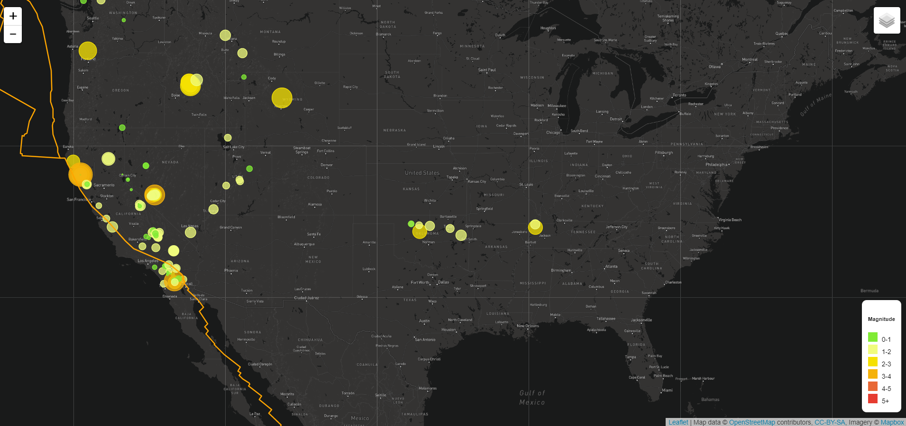

# Earthquake with Leaflet
The United States Geological Survey's (USGS) collect a massive amount of data from all over the world each day, visualizing their data will help better educate the public on issues facing our planet.
This project creates a visualisation map of the USGS's earthquake data using Mapbox API and Leaflet.js that will help users understand easily the locations where there are more chances of a earthquake, and information like fault lines, magnitude and location of previous earthquakes.

## Tools and Technologies used and required to run the code
* MapBox API
* Javascript- D3.js, Leaflet.js
* HTML
* CSS

## How to run the code
1. Download index.html and assets folder
2. On your system, Go to assets -> js -> logic.js, in the 6th line, enter "your mapbox API key", in place of API_KEY, save the file 
3. Open our terminal and cd into the folder you saved the files in, run the command "python -m http.server"
4. Go to your browser, go to the path "localhost:8000", you will see the map, move the map to see earthquake plots, click on the box at the top right corner of the map to change map tiles, click on plots to see details of the earthquake.  

## Output
Map in different tile layers:

## Data Source
* [USGS GeoJSON Feed](http://earthquake.usgs.gov/earthquakes/feed/v1.0/geojson.php)
<!-- * [Plates Data](https://github.com/fraxen/tectonicplates) -->